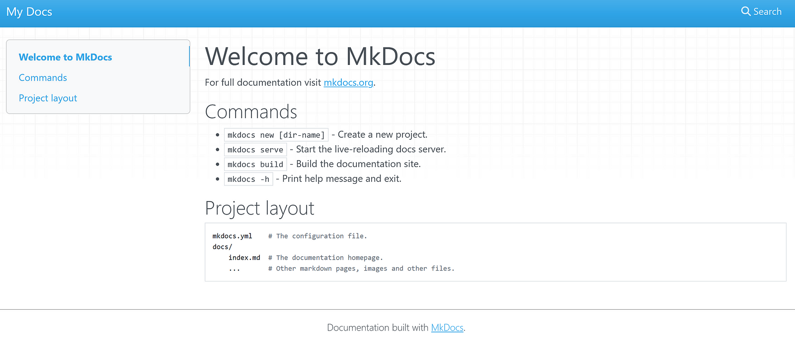
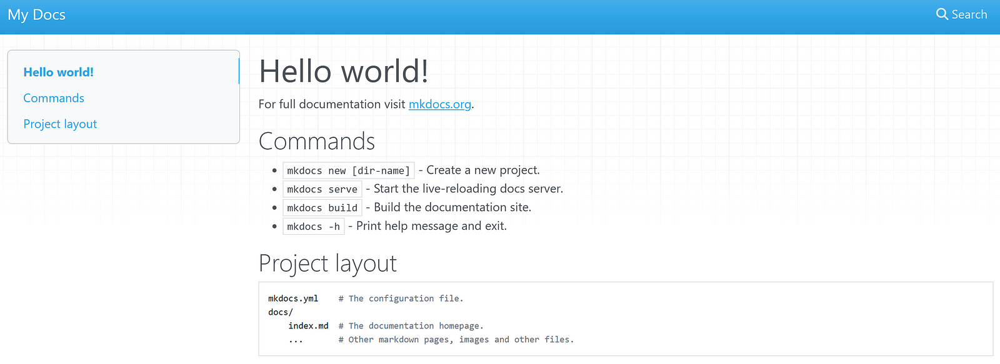
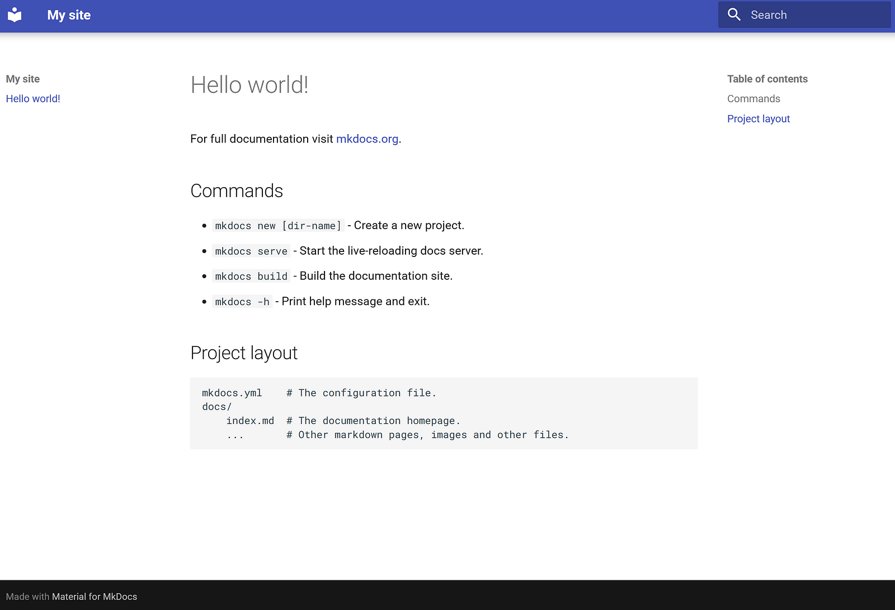
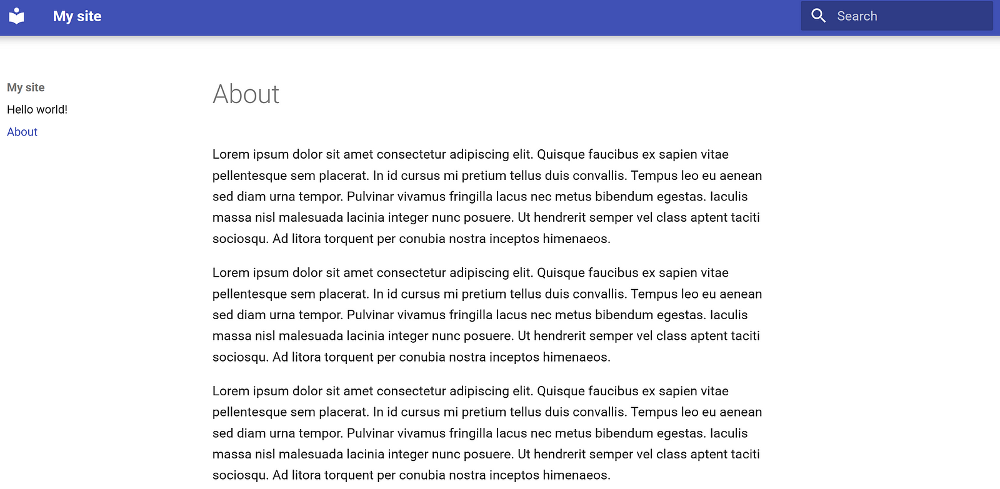

# Create a documentation site with MkDocs

[MkDocs](https://www.mkdocs.org/) is a static site generator (SSG) that creates a documentation website from Markdown files. It's a great [docs-as-code](https://medium.com/@eliotcowley_63744/what-is-docs-as-code-49e8b566cd0c) solution that many companies use, such as Google and Microsoft.

In this article, you will:

* Install all the prerequisites for MkDocs
* Set up a repository for your doc site
* Create a basic site with a couple of pages written in Markdown
* Publish the site to GitHub Pages
* Implement a CI/CD pipeline that publishes the site every time you make changes

For this article, we're going to use [Material for MkDocs](https://squidfunk.github.io/mkdocs-material/), which extends the functionality of MkDocs and uses Google's [Material Design](https://m3.material.io/).


/// caption
The beautiful home page of Material for MkDocs.
///

## Prerequisites

This article is targeted at technical writers of all skill levels and backgrounds. However, here are some things that you should know going in:

* **Command line/terminal:** If you've never touched a command line, I'd recommend [learning some basic commands](https://www.freecodecamp.org/news/command-line-for-beginners/).
* **Git/GitHub:** You should know [the basics](https://github.com/git-guides) of cloning a repository, committing changes, and pushing those changes via the command line.
* **Markdown:** You should know the basics of writing Markdown, [which you can learn in about 10 minutes](https://www.markdownguide.org/).

## Install Material for MkDocs

The easiest way to install Material for MkDocs is through a package manager, a tool that you typically use from the command line that installs and removes packages. A package is a tool or app that someone has made and uploaded to a repository that the package manager has access to. We will use a package manager to install Material for MkDocs, which will install all of its dependencies for us.

I installed [Chocolatey](https://chocolatey.org), a very popular package manager for Windows, but if you're on Mac or Linux there are alternatives you can use, such as [Homebrew](https://brew.sh/) for Mac or [Advanced Package Tool (APT)](https://www.geeksforgeeks.org/linux-unix/apt-command-in-linux-with-examples/) for Linux.

To install Material for MkDocs with Chocolatey, run the following command from your terminal:

```shell
choco install mkdocs-material
```

## Install an Integrated Development Environment (IDE)

If you don't already have one, it's a good idea to install an IDE, which is a fancy way of saying a "code editor." This will allow you to more easily edit the files in your MkDocs project.

I recommend [VSCodium](https://vscodium.com/), an open source version of Microsoft's Visual Studio Code. It has all the benefits of VS Code, without the extra garbage like data tracking and Copilot. (Although if you prefer to use VS Code, then by all means do so!)

## Create a Git repository

Whenever you work on a coding project, it's a good idea to back it up using a version control system. I recommend [creating a repository on GitHub](https://docs.github.com/en/repositories/creating-and-managing-repositories/creating-a-new-repository) and [cloning it to your local machine](https://docs.github.com/en/repositories/creating-and-managing-repositories/cloning-a-repository). To do that, you'll need to install Git, which you can do with Chocolatey using the following command:

```shell
choco install git
```

I won't get into the details of using Git and GitHub here, but I highly recommend checking out the documentation to learn more.

## Create an MkDocs project

In your terminal, navigate to the location where you want to create your MkDocs project (if you cloned a repository, navigate to the location of the repository on your local machine):

```shell
cd <REPOSITORY_PATH>
```

"cd" means "change directory," so this command changes the current directory to the repository root folder.

To create an MkDocs project, run the following command:

```shell
mkdocs new .
```

Open the project folder in your code editor. For example, to open it in VSCodium, run the following command:

```shell
codium <PROJECT_PATH>
```

You'll see that MkDocs has automatically created some files for you. Let's see what the default site looks like by running the following command:

```shell
mkdocs serve
```

If everything works correctly, the terminal outputs a line that says something like `Serving on <URL>`. Open the URL in your browser to see the doc site:


/// caption
A nice little default template, but we'll make it look even nicer with Material.
///

While previewing your site, it will automatically update with any changes you make. For example, open `docs/index.md` and change the first line to the following:

```markdown title="docs/index.md"
# Hello world!
```

The site should automatically update in the browser:


/// caption
No need to rerun any commands — hot reloading is super convenient when developing your doc site.
///

### Configure YAML

YAML is a markup language that MkDocs uses for configuration. If you're using VSCodium or VS Code, follow these steps to enable validation and auto-complete when editing the MkDocs YAML files:

1. Install the [YAML extension](https://marketplace.visualstudio.com/items?itemName=redhat.vscode-yaml).
2. Open **File > Preferences > Settings** and click the **Open Settings (JSON)** button.
3. Add the following code to `settings.json`:

```json title="settings.json"
{
  "yaml.schemas": {
    "https://squidfunk.github.io/mkdocs-material/schema.json": "mkdocs.yaml"
  },
  "yaml.customTags": [ 
    "!ENV scalar",
    "!ENV sequence",
    "!relative scalar",
    "tag:yaml.org,2002:python/name:material.extensions.emoji.to_svg",
    "tag:yaml.org,2002:python/name:material.extensions.emoji.twemoji",
    "tag:yaml.org,2002:python/name:pymdownx.superfences.fence_code_format",
    "tag:yaml.org,2002:python/object/apply:pymdownx.slugs.slugify mapping"
  ]
}
```

### Use the Material theme

The default site looks fine, but let's make it look nicer by using the Material theme. Replace the contents of `mkdocs.yaml` with the following:

```yaml title="mkdocs.yml"
site_name: My site
site_url: https://mydomain.org/mysite
theme:
  name: material
```

Your site now uses the default Material theme:


/// caption
Looking much better already!
///

### Add a page

Let's add a new page to our site:

1. Create a file at `docs/about.md`.
2. Add the following Markdown to the file:

    ```markdown title="docs/about.md"
    # About

    Lorem ipsum dolor sit amet consectetur adipiscing elit. Quisque faucibus ex sapien vitae pellentesque sem placerat. In id cursus mi pretium tellus duis convallis. Tempus leo eu aenean sed diam urna tempor. Pulvinar vivamus fringilla lacus nec metus bibendum egestas. Iaculis massa nisl malesuada lacinia integer nunc posuere. Ut hendrerit semper vel class aptent taciti sociosqu. Ad litora torquent per conubia nostra inceptos himenaeos.

    Lorem ipsum dolor sit amet consectetur adipiscing elit. Quisque faucibus ex sapien vitae pellentesque sem placerat. In id cursus mi pretium tellus duis convallis. Tempus leo eu aenean sed diam urna tempor. Pulvinar vivamus fringilla lacus nec metus bibendum egestas. Iaculis massa nisl malesuada lacinia integer nunc posuere. Ut hendrerit semper vel class aptent taciti sociosqu. Ad litora torquent per conubia nostra inceptos himenaeos.

    Lorem ipsum dolor sit amet consectetur adipiscing elit. Quisque faucibus ex sapien vitae pellentesque sem placerat. In id cursus mi pretium tellus duis convallis. Tempus leo eu aenean sed diam urna tempor. Pulvinar vivamus fringilla lacus nec metus bibendum egestas. Iaculis massa nisl malesuada lacinia integer nunc posuere. Ut hendrerit semper vel class aptent taciti sociosqu. Ad litora torquent per conubia nostra inceptos himenaeos.
    ```

3. Save your changes. MkDocs automatically adds a page to your site, which you can open from the left sidebar:


/// caption
Writing documentation with MkDocs is as easy as that.
///

## Publish the site to GitHub Pages

Now that we have a doc site, let's publish it so anyone can see it. If you are using a GitHub repository, you can use [GitHub Pages](https://pages.github.com/) to publish to a public URL.

Let's create a Continuous Integration/Continuous Deployment (CI/CD) pipeline so that every time we push changes to our repository, GitHub automatically publishes to GitHub Pages:

1.  Create a new file in the project folder at `.github/workflows/ci.yml`.
2.  Add the following code to the file:

    ```yaml title=".github/workflows/ci.yml"
    name: ci 
    on:
    push:
        branches:
        - master 
        - main
    permissions:
    contents: write
    jobs:
    deploy:
        runs-on: ubuntu-latest
        steps:
        - uses: actions/checkout@v4
        - name: Configure Git Credentials
            run: |
            git config user.name github-actions[bot]
            git config user.email 41898282+github-actions[bot]@users.noreply.github.com
        - uses: actions/setup-python@v5
            with:
            python-version: 3.x
        - run: echo "cache_id=$(date --utc '+%V')" >> $GITHUB_ENV 
        - uses: actions/cache@v4
            with:
            key: mkdocs-material-${{ env.cache_id }}
            path: .cache 
            restore-keys: |
                mkdocs-material-
        - run: pip install mkdocs-material 
        - run: mkdocs gh-deploy --force
    ```

3. Now any time you push to the `master` or `main` branches, GitHub will automatically publish the changes to GitHub Pages. Push your changes now to see it in action:

    ```shell
    git add .
    git commit -m "<COMMENT>"
    git push
    ```

4. GitHub will create a `gh-pages` branch. On GitHub, [set your repository to publish GitHub Pages from this branch](https://docs.github.com/en/pages/getting-started-with-github-pages/configuring-a-publishing-source-for-your-github-pages-site) by clicking **Settings > Pages**, and under **Branch**, selecting the `gh-pages` branch and clicking **Save**.

5. Back in your code editor, open `mkdocs.yml` and set `site_url` to the URL of your GitHub Pages site:

    ```yaml title="mkdocs.yml"
    site_url: https://<GITHUB_USERNAME>.github.io/<REPOSITORY_NAME>
    ```

6. Push your changes and watch your pipeline run on GitHub. After it completes, check your published site to see it live!

## Next steps

Congratulations, you've just built your own documentation site with MkDocs! Feel free to check the [Material for MkDocs documentation](https://squidfunk.github.io/mkdocs-material/customization/) to customize it further and extend the theme. Also see the base [MkDocs documentation](https://www.mkdocs.org/user-guide/) to learn how to add your own docs and build out the site.

In future posts, I would like to explore customizing the look and feel of the site, creating an information architecture, and translating the site, so stay tuned!
