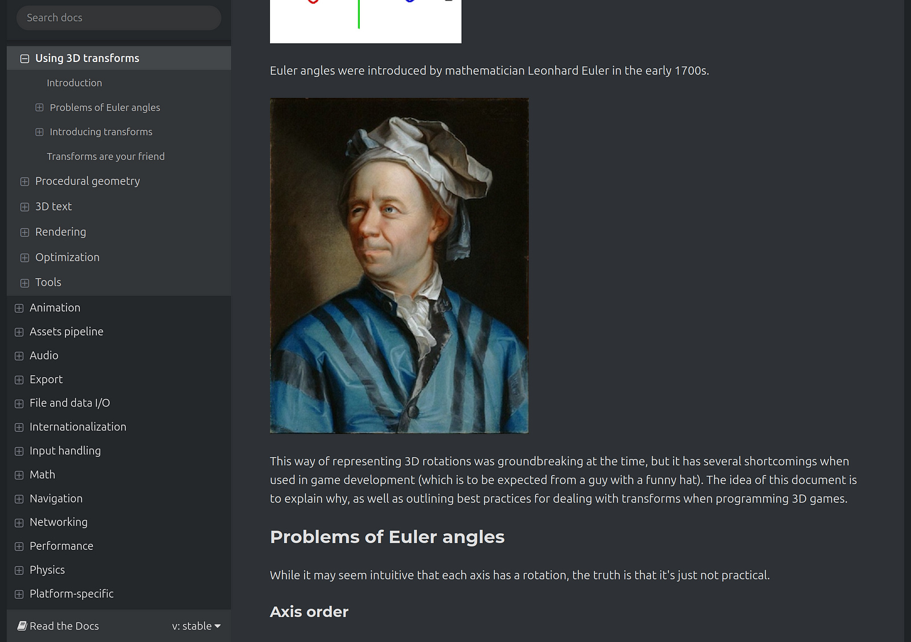
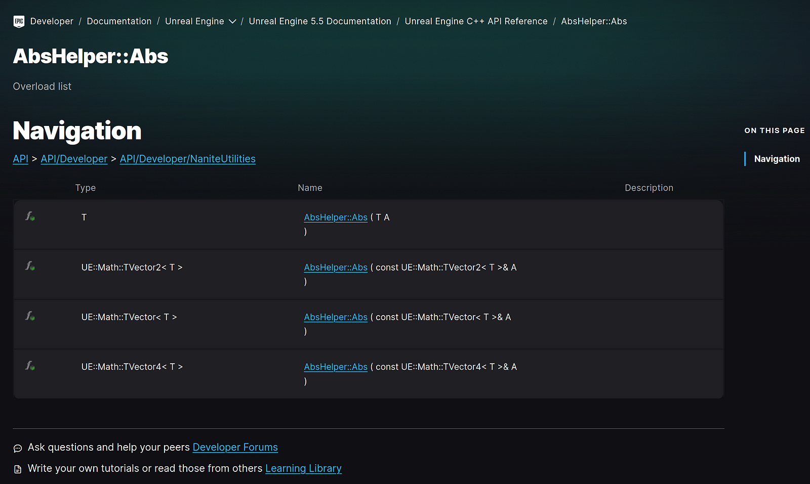

# The case for technical writers (and why developer documentation matters)

Many software companies tend to undervalue documentation. Of course, for a startup that's just trying to survive, the most important thing is to actually make a product that you can sell. So naturally, hiring managers will prioritize engineers over other roles.

However, as a company matures and acquires more users, and as their products inevitably become more complicated, good documentation that allows their users to self-serve becomes essential. You can't give white-glove on-boarding service to every single customer - that just doesn't scale.

If you talk to any technical writer, they will almost certainly tell you that their team is woefully understaffed. The irony is that by de-prioritizing documentation, your users will require more hand-holding, which takes more time and money away from actually making the product.

By sacrificing documentation quality, you may make short-term gains in the savings from not hiring dedicated writers, but in the long-term you damage relationships with customers who are frustrated by the lack of support and their inability to learn and solve issues on their own. When you prioritize documentation, you get exponential gains in time and money saved from reduced support requests and build goodwill with your customers.

APIs and developer-focused products in particular really require good documentation. One could argue that a consumer app should be self-explanatory, and a user should be able to navigate the UI without resorting to reading the docs. But to call an API, you need to know the inputs, outputs, what's required, what's optional, sample code - the list goes on.

Good documentation also provides an unintended benefit: it's great advertising. As a developer choosing which product to use to solve a particular problem, one of the first things you do is check out the docs. You can have the fanciest landing page in the world, with "AI" plastered all over the place, but if the doc experience is bad, you're not going to grow. You may win over product managers and leadership, but you won't convince developers.

In my spare time, [I make video games](https://eliotcowley.dev). Lately I've been learning Godot, an open-source, free game engine for making both 2D and 3D games. One of the most frequently cited benefits of Godot over its competitors is its documentation. While Godot has a very small market share compared to [Unity](https://unity.com) and [Unreal Engine](https://www.unrealengine.com) (two of the most popular game engines), its community is very passionate and dedicated to helping each other. This collaborative spirit means that documentation is easy to read, thorough, and up to date, and the product is rapidly picking up new users.

/// caption
A Godot doc about 3D. I mean, look at this. When was the last time you saw an 18th-century painting in a developer doc? Reading the Godot docs is an absolute pleasure.
///

In comparison, Unreal Engine, while extremely powerful, is also very complex and has incredibly sparse documentation, meaning that its primary customer base is big companies that can get white-glove support. Search around online and you will find lots of complaints from new users about the lack of good C++ documentation.

/// caption
I'm picking on Unreal a bit here, but...woof. Not even a single sentence about what the function does. Sure, you can probably figure it out from the name, but come on.
///

One common way that companies try to solve the documentation problem is to lean on engineers to write the docs. Engineers should be documenting their code anyway, and they know the APIs the best, so it makes sense. Especially in large companies with highly complex products, and a small tech writing team, writers can't be expected to know everything.

However, when a company relies almost entirely on engineers to write the docs, you get the Unreal Engine outcome. Engineers love to automate, and automating documentation is great to an extent, but you still need an actual human to explain, in beginner-friendly language, what an API does and how to use it.

This is where the magic of a tech writer happens. The writer asks the engineer to explain the API, and the writer takes that explanation and puts it into language that anyone can understand. Engineers are incredibly smart, but this often prevents them from writing from the perspective of a user - they often assume that the user would just know certain things, which leads to sparse and cryptic documentation.

Engineers are also incredibly busy, and documentation is usually the last priority, if it's even part of the release cycle. Documentation is often done after the fact, and by then, the team is busy with the next feature.

A dedicated technical writer, who embeds with their respective engineering team and learns the ins and outs of their APIs, is invaluable. They are uniquely positioned to bridge the gap between user and engineer, and can even be employed to do things like developer outreach and advocacy.

A good technical writer is also highly curious and asks lots of questions, some of which the engineering team may not have thought about. This can even lead to improvements in the product itself - countless times throughout my career, I have asked questions that made product teams realize they didn't account for some use case, and were able to improve the product based on my suggestions. Tech writers are usually familiar with many products across the company and can see the big picture better than teams that are highly focused on a single product.

As someone who has been a tech writer for over nine years, I am somewhat biased, but I have seen time and time again companies de-prioritize documentation and question the value of technical writers, only to realize later on that they can't just make their engineers and AI write all the docs. Then, when they're unable to scale because they're overloaded with support requests, they finally get it.

I hope I've been able to prove the value that technical writers bring. I plan to write more articles that go deeper into the technical aspects of API documentation, as well as the principles of good documentation that I've developed throughout my career, so stay tuned!
