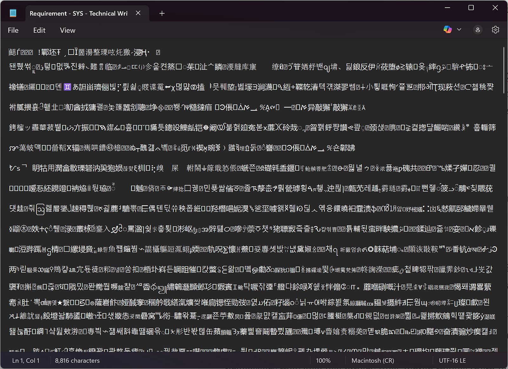
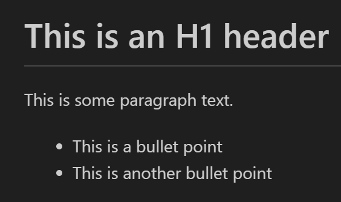
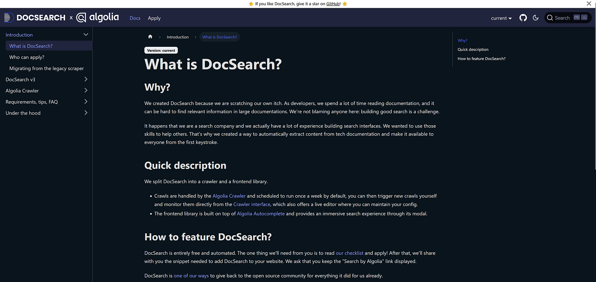
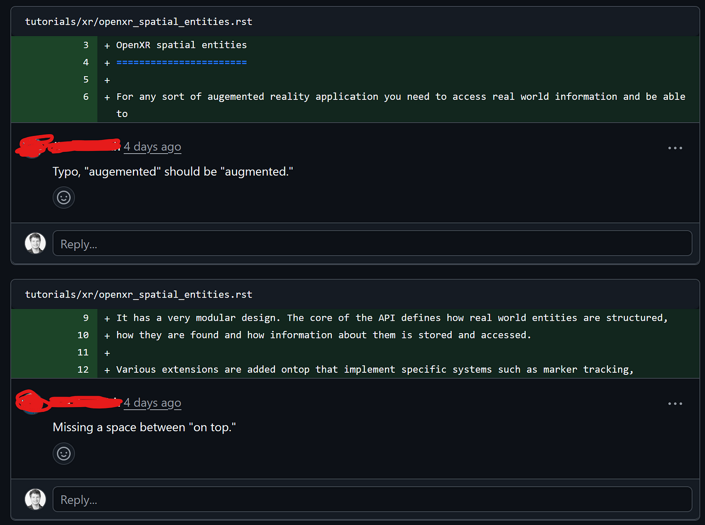

# What is Docs as Code?

"Docs as Code" is the idea that technical writers should treat documentation the same way that software developers treat code. The typical workflow looks like this:

* Write docs in a plain text format like [Markdown](https://www.markdownguide.org/basic-syntax)
* Create a website using a static site generator like [Docusaurus](https://docusaurus.io)
* Host the files in a version control system like [Git](https://github.com/git-guides)
* Manage reviews on pull requests
* Use a Continuous Integration/Continuous Deployment (CI/CD) pipeline to test, stage, and publish documentation any time you push a change

If any of those words scare you, don’t worry! You don’t have to be an engineer to use a docs-as-code workflow. Once you get the hang of it, I think you’ll prefer it over traditional word processors and content management systems (CMS’s).

## Benefits of Docs as Code

The primary benefit of using a docs-as-code workflow is that you can collaborate more easily with engineers who are already used to a very similar workflow. Software engineers know how to review pull requests and make contributions to documentation using Markdown and Git. This means that they don’t have to spend time and energy learning new software just to write and review documentation, and makes it more likely that they will actually contribute.

Even if you don’t work with software engineers, a docs-as-code workflow can help you save money and frustration with proprietary CMS’s, which are often expensive and limited. There are many free and open-source solutions available for docs as code that give you a lot more control and flexibility.

I was lucky enough to use a docs-as-code system at my very first company. We were blessed with a few dedicated web developers that maintained it for us, and once I got the hang of it, it was a dream to work with. I then used other software like Microsoft Word and Confluence at other companies, and having gone through the pain of those experiences, now one of the things I look for when applying for jobs is whether they use docs as code.

## Components of Docs as Code

As I mentioned in the introduction, every docs-as-code system contains a few key components. Let’s go through them one by one.

### Plain text doc format (often Markdown)

When a software engineer writes code, they are really just inputting text into a text editor. The code that they write is exactly as shown in the editor.

When you write a document in a word processor, the software formats the text behind the scenes to style it. This means that content and style are tangled up, which goes against the principle of [separation of concerns](https://www.geeksforgeeks.org/software-engineering/separation-of-concerns-soc). Word processors may also use binary files, which makes them look like garbage when you try to open them in a plain text editor, requiring you to use compatible software.


/// caption
Here's what happened when I tried to open a DOCX file in Notepad. Side note: Why is Copilot in Notepad? Who asked for that???
///

Have you ever tried to position or size an image in Microsoft Word, or had an extra page that you just couldn't delete? This is because there is a lot going on behind the scenes that word processors don't show you. With plain text, on the other hand, you have complete control over the content and can format it exactly how you want.

Markdown is a plain text format that is easy to read and write, and allows you to format it using intuitive syntax. For example, the following Markdown establishes a header, an intro paragraph, and some bullet points:

```markdown
# This is an H1 header

This is some paragraph text.

* This is a bullet point
* This is another bullet point
```

Here's what it looks like when I preview it in my code editor:


/// caption
Simple!
///

Markdown is used for README files in Git repositories, so most software engineers are already familiar with it. [It takes about 10 minutes to learn](https://www.writethedocs.org/guide/writing/markdown). Though it is very limited in order to keep it simple, there are also various extensions that add features which are often supported by docs-as-code tools. Markdown also supports HTML, so if all else fails, you can always fall back on that.

### Static site generators (SSGs)

You can write your docs in Markdown, but you still need a way to put them on a website that others can access. Luckily, you don't need to be a web developer to create a documentation website. These days there are plenty of free, open-source options available that are relatively easy to set up.

At one company I worked at we used [Docusaurus](https://docusaurus.io), which is built and maintained by Meta (though it is free and open source). It's built on the React web development framework, so most web developers should find it easy to work with. Documentation is written in [MDX](https://mdxjs.com/docs/what-is-mdx), a combination of Markdown and JSX. As a technical writer, though, all you really need to worry about is writing docs in Markdown.


/// caption
[Algolia's doc site](https://docsearch.algolia.com/docs/what-is-docsearch), an example of a site that uses Docusaurus. Some major companies use Docusaurus and you can make some pretty impressive sites with it.
///

Though Docusaurus is fully-featured and highly customizable, that comes at the cost of complexity. It can be tough to work with if you're not at least somewhat comfortable with web development. There are other options like [Read the Docs](https://about.readthedocs.com), [MkDocs](https://www.mkdocs.org), and [Jekyll](https://jekyllrb.com) which may be easier to use, although I don't have much experience with them.

Ideally, you have at least one dedicated developer on your team to maintain the documentation site, but if not, you can experiment with some SSGs and see which one works best for you.

### Version control (Git)

When writing code with a team of people, you need a way to save and back up that code so everyone is working with the same versions and you can roll back to previous versions if something catastrophic happens. That's where Git comes in:

* Create a "repository" (repo) on a website like [GitHub](https://github.com) or [GitLab](https://about.gitlab.com)
* "Clone" the repo onto your local computer
* Make changes to files in the repo
* "Push" the changes to the repo on GitHub/GitLab
* Other people on your team "pull" those changes to get them onto their local computers

Git has a concept of "branches," where each branch has a completely independent version of the files in the repository. You have one "main" branch, and you can create branches off of that, then create branches of off those branches, and so on. When you're done with your work in a particular branch, you merge it into its base branch.

I'll admit, Git can get complicated, especially for non-technical users. But there are really only a few key commands in the terminal that you need to know, or you can use a GUI app. I recommend taking some time to get familiar with it using a tutorial like [this one on Microsoft Learn](http://learn.microsoft.com/training/modules/intro-to-git).

### Manage reviews on pull requests

One of the great benefits of treating docs as code is that by hosting your repository on a website like GitHub or GitLab, you get pull requests for free.

A pull request is a way for people to review changes before you merge them to the main branch. The website shows exactly what changes were made, and team members can comment on specific lines to provide feedback.


/// caption
A [pull request from the Godot docs](https://github.com/godotengine/godot-docs/pull/11015). It's easy to see what was added and make comments on specific lines.
///

This review mechanism solves a lot of issues that technical writers often have with gathering reviews for docs. Google Docs and Confluence track changes and version history, and allow for in-line comments, but they can be difficult to maintain and aren't very suitable for publishing to external doc sites.

### Continuous Integration/Continuous Deployment (CI/CD)

CI/CD is the process of continuously testing changes that you make to your repository, and if the tests pass, deploying (publishing) those changes to your live website in production.

This means that everything is basically done in one step. Once you merge your changes to the main branch, all you have to do is sit back and wait for the changes to propagate to your live site. No multi-step publishing workflow. Having dealt with tools that require hours of manual, error-prone work, I can't tell you how game-changing this is.

Most websites that host Git repositories provide CI/CD features, so I recommend that you read about the specific website that you use - for example, [this explanation from GitLab](https://about.gitlab.com/topics/ci-cd).

## Conclusions

I may have thrown a lot at you in this post, and much of it may seem pretty abstract. If you're lost, I recommend poking around with some of the tools I mentioned to get your hands dirty and see for yourself how they work. Download a code editor like [VSCodium](https://vscodium.com) and create a Markdown file. Make an account on [GitHub](https://github.com/home) and create a repository. Download [Git](https://git-scm.com/downloads) and try pushing to the repository.

Even though I was a Computer Science major, these tools were new to me in my first job. They took some getting used to, but once I got familiar with them, they became indispensable. People with experience with these tools are highly desired by many companies, and by adding them to your skill set, you'll make yourself even more marketable.

In a future post, I'm going to take a look at setting up an [mkdocs](https://www.mkdocs.org) site, which I haven't done before. Join me as I fumble my way through!
